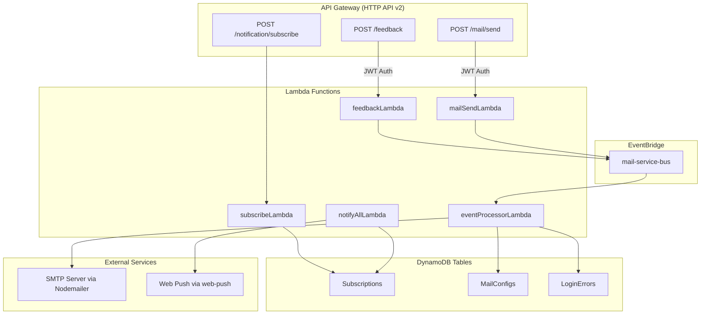

# Design Document: Serverless Lambda Refactor

## Overview

This design describes the refactoring of the existing NestJS mail microservice into an AWS serverless architecture. The system replaces NestJS HTTP controllers with AWS Lambda functions behind API Gateway, PostgreSQL/Sequelize with DynamoDB, and Kafka with Amazon EventBridge for event-driven processing. The existing `web-push`, `nodemailer`, and `crypto-js` libraries are retained for push notifications, SMTP delivery, and password encryption respectively.

The serverless project uses the Serverless Framework (`serverless.yml`) for infrastructure-as-code, TypeScript for Lambda handler logic, and AWS SDK v3 for DynamoDB access. The new project structure coexists alongside the existing NestJS code to enable incremental migration.

### Key Design Decisions

1. **Serverless Framework over AWS SAM** — Chosen for its mature plugin ecosystem (serverless-offline, serverless-esbuild) and simpler configuration syntax for API Gateway + Lambda + DynamoDB stacks.
2. **esbuild for bundling** — Fast TypeScript compilation and tree-shaking for minimal Lambda deployment packages.
3. **AWS SDK v3 DynamoDBDocumentClient** — Provides marshalling/unmarshalling of native JavaScript objects for cleaner DynamoDB interactions.
4. **API Gateway HTTP API (v2)** — Lower latency and cost compared to REST API (v1), with native JWT authorizer support.
5. **EventBridge over SQS/SNS** — Content-based filtering via event patterns, schema registry support, and native integration with Lambda as targets.
6. **Single-table design NOT used** — Two separate DynamoDB tables (Subscriptions, MailConfigs) for clarity given the small number of access patterns. A LoginErrors table stores error tracking state.

---

## Architecture



### Request Flow

1. **Synchronous path**: Client → API Gateway → Lambda → DynamoDB (subscribe) or EventBridge (feedback/mail-send) → Response
2. **Asynchronous path**: EventBridge rule → Event Processor Lambda → Retrieve SMTP config from DynamoDB → Decrypt password → Send email via Nodemailer
3. **Push notification path**: Trigger (manual/scheduled) → Notify All Lambda → Fetch subscriptions from DynamoDB → Send via web-push → Cleanup expired

---

## Components and Interfaces

### Project Structure

```
serverless/
├── serverless.yml              # Infrastructure definition
├── tsconfig.json               # TypeScript config for serverless
├── package.json                # Serverless-specific dependencies
├── src/
│   ├── handlers/
│   │   ├── subscribe.ts        # POST /notification/subscribe
│   │   ├── feedback.ts         # POST /feedback
│   │   ├── mailSend.ts         # POST /mail/send
│   │   ├── eventProcessor.ts   # EventBridge → email delivery
│   │   └── notifyAll.ts        # Push notification broadcast
│   ├── services/
│   │   ├── dynamodb.ts         # DynamoDB client singleton
│   │   ├── eventbridge.ts      # EventBridge publish helper
│   │   ├── mail.service.ts     # Nodemailer transporter + send
│   │   ├── notification.service.ts  # web-push logic
│   │   └── errorTracker.ts     # Login error rate tracking
│   ├── utils/
│   │   ├── validation.ts       # Input validation (reused logic)
│   │   ├── encryption.ts       # CryptoJS encrypt/decrypt
│   │   ├── identity.ts         # Client IP + device parsing
│   │   ├── templates.ts        # Email HTML templates
│   │   ├── logger.ts           # Structured JSON logger
│   │   └── constants.ts        # Environment variable config
│   └── types/
│       ├── events.ts           # EventBridge event type definitions
│       ├── models.ts           # DynamoDB item type definitions
│       └── api.ts              # Request/response type definitions
└── tests/
    ├── unit/
    │   ├── validation.test.ts
    │   ├── encryption.test.ts
    │   ├── errorTracker.test.ts
    │   └── templates.test.ts
    └── integration/
        ├── subscribe.test.ts
        ├── feedback.test.ts
        └── mailSend.test.ts
```

### Handler Interfaces

#### Subscribe Lambda

```typescript
// POST /notification/subscribe
interface SubscribeRequest {
  subscription: {
    endpoint: string;
    keys: { p256dh: string; auth: string };
    deviceId?: string;
  };
  userAgent?: string;
}

// Response: 201 (new) | 200 (exists) | 400 (validation error)
```

#### Feedback Lambda

```typescript
// POST /feedback (JWT required)
interface FeedbackRequest {
  name: string;
  email: string;
  message: string;
}

// Response: 201 (published) | 400 (validation error) | 401 (unauthorized)
```

#### Mail Send Lambda

```typescript
// POST /mail/send (JWT required)
interface MailSendRequest {
  from: string;
  to: string;
  message?: string;
  template?: string;
  apiUser?: string;  // extracted from JWT claims
}

// Response: 201 (published) | 400 (error) | 401 (unauthorized)
```

#### Event Processor Lambda

```typescript
// Triggered by EventBridge rules
interface MailEventDetail {
  eventType: 'user.login' | 'user.signup' | 'submit.feedback' | 'mail.send' | 'user.login.error';
  payload: Record<string, any>;
  correlationId: string;
  timestamp: string;
}
```

### Service Interfaces

#### DynamoDB Service

```typescript
import { DynamoDBDocumentClient, GetCommand, PutCommand, DeleteCommand, QueryCommand, ScanCommand } from '@aws-sdk/lib-dynamodb';

class DynamoDBService {
  private client: DynamoDBDocumentClient;

  getSubscriptionByEndpoint(endpoint: string): Promise<Subscription | null>;
  createSubscription(subscription: SubscriptionItem): Promise<void>;
  deleteSubscription(id: string): Promise<void>;
  getAllSubscriptions(): Promise<Subscription[]>;

  getMailConfigByEmail(email: string): Promise<MailConfig | null>;
  createMailConfig(config: MailConfigItem): Promise<void>;

  getLoginErrors(windowStart: number): Promise<LoginErrorItem[]>;
  putLoginError(error: LoginErrorItem): Promise<void>;
  clearLoginErrors(): Promise<void>;
}
```

#### EventBridge Service

```typescript
import { EventBridgeClient, PutEventsCommand } from '@aws-sdk/client-eventbridge';

class EventBridgeService {
  publishEvent(detailType: string, detail: Record<string, any>, source?: string): Promise<void>;
}
```

#### Encryption Module

```typescript
// Reuses CryptoJS AES from existing codebase
function encrypt(data: string, key: string): string;
function decrypt(ciphertext: string, key: string): string;
```

---

## Data Models

### Subscriptions Table

| Attribute   | Type   | Key         | Notes                          |
|-------------|--------|-------------|--------------------------------|
| id          | String | Partition   | UUID v4                        |
| endpoint    | String | GSI-PK      | Push subscription endpoint URL |
| keys        | String |             | JSON-stringified push keys     |
| deviceId    | String |             | Optional device identifier     |
| userAgent   | String |             | Browser/device info            |
| createdAt   | String |             | ISO 8601 timestamp             |
| updatedAt   | String |             | ISO 8601 timestamp             |

**GSI: endpoint-index** — Partition key: `endpoint`, projection: ALL

### MailConfigs Table

| Attribute   | Type   | Key         | Notes                           |
|-------------|--------|-------------|---------------------------------|
| id          | String | Partition   | UUID v4                         |
| email       | String | GSI-PK      | Unique user email               |
| smtpHost    | String |             | Default: smtp.gmail.com         |
| smtpPort    | Number |             | Default: 465                    |
| smtpUser    | String |             | SMTP username                   |
| smtpPass    | String |             | AES-encrypted SMTP password     |
| createdAt   | String |             | ISO 8601 timestamp              |
| updatedAt   | String |             | ISO 8601 timestamp              |

**GSI: email-index** — Partition key: `email`, projection: ALL

### LoginErrors Table

| Attribute   | Type   | Key         | Notes                          |
|-------------|--------|-------------|--------------------------------|
| id          | String | Partition   | UUID v4                        |
| timestamp   | Number | Sort        | Unix epoch milliseconds        |
| email       | String |             | The email that failed login    |
| clientIp    | String |             | Source IP of failed attempt     |
| ttl         | Number |             | DynamoDB TTL for auto-expiry   |

**TTL attribute**: `ttl` — Auto-deletes records after the error time window expires (default 60s).

---


## Correctness Properties

*A property is a characteristic or behavior that should hold true across all valid executions of a system — essentially, a formal statement about what the system should do. Properties serve as the bridge between human-readable specifications and machine-verifiable correctness guarantees.*

### Property 1: Required field validation rejects incomplete payloads

*For any* request payload where at least one required field is missing or empty, the validation function SHALL return an error indicating which fields are missing, and the handler SHALL return a 400 status.

**Validates: Requirements 1.5, 2.4**

### Property 2: Encryption round-trip preserves password

*For any* non-empty string used as an SMTP password, encrypting it with the configured encryption key and then decrypting the result SHALL produce the original string.

**Validates: Requirements 4.2, 7.3, 7.4**

### Property 3: Error rate threshold triggers alert exactly at boundary

*For any* sequence of login error events, when the count of errors with timestamps within the configured time window reaches or exceeds MAX_ERRORS, the error tracker SHALL trigger an alert. When the count is below MAX_ERRORS, no alert SHALL be triggered.

**Validates: Requirements 5.1, 5.2, 5.3**

### Property 4: Expired subscription cleanup on 410

*For any* set of push notification subscriptions, after attempting delivery to all, every subscription that received a 410 (Gone) response SHALL be deleted from the Subscription_Table, and no non-410 subscription SHALL be deleted.

**Validates: Requirements 6.3, 8.3**

### Property 5: Broadcast delivery count invariant

*For any* list of active subscriptions and a notification payload, after broadcasting, the returned successful delivery count SHALL equal the total subscription count minus the number of failed deliveries.

**Validates: Requirements 8.2, 8.4**

### Property 6: Structured JSON logging completeness

*For any* log entry produced by the logger module, the output SHALL be valid JSON containing at minimum a `correlationId`, `timestamp`, and `level` field. Error log entries SHALL additionally contain `stackTrace` and `inputSummary` fields.

**Validates: Requirements 10.1, 10.3, 10.4**

### Property 7: Email format validation

*For any* string that does not conform to a valid email format (user@domain.tld pattern), the email validator SHALL reject it. *For any* string that does conform, it SHALL be accepted.

**Validates: Requirements 2.5**

---

## Error Handling

### Lambda Handler Error Strategy

Each Lambda handler follows a consistent error handling pattern:

1. **Input Validation Errors (400)** — Caught at the top of each handler before any side effects. Returns structured error response immediately.
2. **Authentication Errors (401)** — Handled by API Gateway JWT authorizer before the Lambda is invoked.
3. **Service Errors (500)** — Caught by a top-level try/catch in each handler. Logs full context and returns a generic error response.
4. **EventBridge Publish Failures** — The mail-send handler attempts to publish an error event. If that also fails, it logs and returns 500.
5. **DynamoDB Errors** — Retried via AWS SDK built-in retry (3 attempts with exponential backoff). If exhausted, logged and surfaced as 500.

### Error Response Format

```typescript
interface ErrorResponse {
  statusCode: number;
  body: {
    success: false;
    error: string;
    correlationId: string;
  };
}
```

### Event Processor Error Handling

- **Missing SMTP config**: Log warning with event details, skip email delivery (no retry since config won't appear on retry).
- **SMTP delivery failure**: Log error with full context (event type, recipient, error message). Do NOT retry — EventBridge can be configured with DLQ for retries if needed.
- **Encryption/decryption failure**: Log error, skip delivery. Indicates corrupted config data.

### Dead Letter Queue

EventBridge rules targeting the Event Processor Lambda should be configured with an SQS Dead Letter Queue for events that fail after Lambda's built-in retry (2 retries by default for async invocations).

---

## Testing Strategy

### Unit Tests (Jest)

Unit tests cover individual functions with mocked dependencies:

- **Validation functions**: `checkForRequiredFields`, `validateEmail` — test with concrete examples of valid/invalid inputs
- **Encryption module**: `encrypt`/`decrypt` — test round-trip with known values
- **Template selection**: `mailTemplates` — test each event type maps to correct subject/html
- **Error tracker logic**: Test threshold boundary behavior
- **Logger module**: Test JSON output format
- **Handler logic**: Mock DynamoDB, EventBridge, Nodemailer; test request→response flow

### Property-Based Tests (fast-check)

Property-based tests use [fast-check](https://github.com/dubzzz/fast-check) to verify universal properties with generated inputs. Each property test runs a minimum of 100 iterations.

| Property | Test File | Library |
|----------|-----------|---------|
| Property 1: Required field validation | `tests/unit/validation.test.ts` | fast-check |
| Property 2: Encryption round-trip | `tests/unit/encryption.test.ts` | fast-check |
| Property 3: Error rate threshold | `tests/unit/errorTracker.test.ts` | fast-check |
| Property 4: Expired subscription cleanup | `tests/unit/notification.test.ts` | fast-check |
| Property 5: Broadcast delivery count | `tests/unit/notification.test.ts` | fast-check |
| Property 6: Structured JSON logging | `tests/unit/logger.test.ts` | fast-check |
| Property 7: Email format validation | `tests/unit/validation.test.ts` | fast-check |

**Tag format for each PBT**: `Feature: serverless-lambda-refactor, Property {N}: {title}`

**Configuration**: Each property test uses `fc.assert(fc.property(...), { numRuns: 100 })` minimum.

### Integration Tests

Integration tests run against deployed infrastructure (or serverless-offline for local dev):

- API Gateway routing verification
- JWT authorizer behavior (valid/invalid/missing tokens)
- DynamoDB read/write through actual SDK calls
- EventBridge event publication and rule triggering
- End-to-end: POST → Lambda → EventBridge → Event Processor → (mocked) SMTP

### Test Commands

```bash
# Unit + property tests
npm test

# Integration tests (requires serverless-offline or deployed stack)
npm run test:integration

# Single execution (no watch mode)
npx jest --run
```
